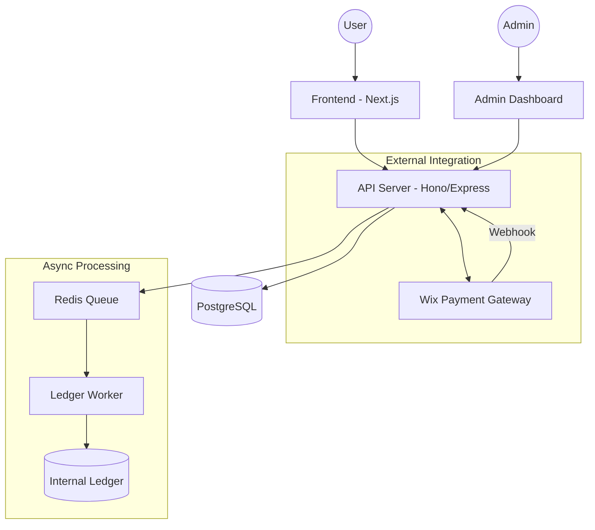
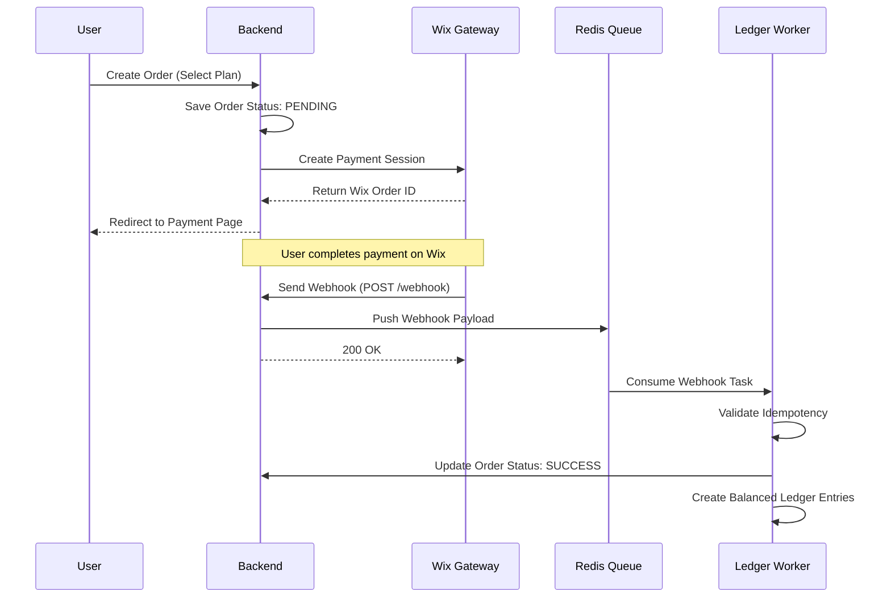

# 📄 Product Requirements Document (PRD)
## InsureHealth: Health Insurance Payment System

---

## 1. 🎯 Overview
**InsureHealth** adalah platform asuransi kesehatan digital yang memungkinkan pengguna membeli paket asuransi secara instan. Sistem ini mengintegrasikan alur pembayaran eksternal (menggunakan Wix sebagai gateway simulasi) dengan sistem **Double-Entry Ledger** internal untuk menjamin akurasi finansial dan transparansi data transaksi.

### Key Capabilities:
- **Order Management:** Pemrosesan pesanan dari inisiasi hingga finalisasi.
- **Wix Integration:** Sinkronisasi status pembayaran via Webhooks.
- **Double-Entry Ledger:** Pencatatan setiap transaksi ke dalam sistem akuntansi yang seimbang (balanced).
- **Automated Reconciliation:** Laporan perbandingan antara data internal dan laporan gateway untuk mendeteksi ketidaksesuaian (mismatch).

---

## 2. 🚀 Goals & Scope

### Primary Goals
1.  **Reliability:** Memastikan setiap pembayaran tercatat dengan benar di Ledger.
2.  **Accuracy:** Implementasi double-entry (debit/kredit) untuk mencegah kebocoran data finansial.
3.  **Asynchronicity:** Menggunakan Message Queue (Redis) untuk menangani webhook dengan beban tinggi tanpa kegagalan sistem.
4.  **Auditability:** Menyediakan report rekonsiliasi yang siap diaudit.

### Non-Goals (Out of Scope)
- Sistem autentikasi pengguna yang kompleks (Identity Provider).
- Sistem refund otomatis yang rumit.
- Dukungan Multi-currency (hanya mendukung IDR fix).
- Mesin penagihan berlangganan otomatis (Subscription recurring).

---

## 3. 👤 User Personas

| Role               | Responsibilities             | Key Actions                                                               |
|:-------------------|:-----------------------------|:--------------------------------------------------------------------------|
| **Public User**    | Konsumen akhir asuransi      | Browse plans, create orders, perform payments, track status.              |
| **Internal Admin** | Penanggung jawab operasional | Monitor orders, audit ledger, trigger reconciliation, analyze mismatches. |

---

## 4. 🧱 High Level Architecture

Sistem ini didesain dengan pendekatan **Event-Driven Architecture** untuk menjamin data integrasi tetap konsisten.

---

## 5. 🧾 Core Entities (Data Schema)

### 5.1 Orders
Tabel utama untuk melacak niat transaksi pengguna.

| Field          | Type          | Description                            |
|:---------------|:--------------|:---------------------------------------|
| `id`           | UUID          | Internal transaction ID (Primary Key). |
| `wix_order_id` | VARCHAR       | ID Referensi dari Wix Gateway.         |
| `product_id`   | INT           | ID Paket Asuransi yang dibeli.         |
| `amount`       | DECIMAL(19,2) | Nominal transaksi.                     |
| `status`       | ENUM          | `PENDING`, `SUCCESS`, `FAILED`.        |

### 5.2 Ledger Entries (Double-Entry)
Pencatatan akuntansi untuk menjamin keseimbangan finansial.

| Field            | Type          | Description                              |
|:-----------------|:--------------|:-----------------------------------------|
| `id`             | UUID          | Primary Key.                             |
| `transaction_id` | UUID          | Foreign Key ke Orders.                   |
| `account_type`   | ENUM          | `REVENUE`, `GATEWAY_RECEIVABLE`.         |
| `amount`         | DECIMAL(19,2) | Nominal (+ untuk Credit, - untuk Debit). |

> [!IMPORTANT]
> **Audit Rule:** `SUM(amount)` untuk setiap `transaction_id` HARUS menghasilkan nilai 0.

---

## 6. 🔄 Process Workflows

### 6.1 Payment Initiation & Webhook Flow

---

## 7. 🔁 Reconciliation System

Rekonsiliasi otomatis dilakukan untuk memverifikasi kecocokan antara **Internal Ledger** dan **Gateway Statement**.

### Perbandingan Data:
1.  **Status Match:** Apakah di internal dan Wix sama-sama menunjukkan `SUCCESS`?
2.  **Amount Match:** Apakah nominal yang diterima sesuai dengan yang dicatat?
3.  **Existence Match:** Apakah ada transaksi di Wix yang tidak tercatat di internal (atau sebaliknya)?

### Contoh Laporan Rekonsiliasi:
| Wix Order ID | Internal Amount | Gateway Amount | Status  | Result                    |
|:-------------|:----------------|:---------------|:--------|:--------------------------|
| WX-001       | Rp 3.500.000    | Rp 3.500.000   | SUCCESS | ✅ Match                   |
| WX-002       | Rp 2.000.000    | Rp 1.500.000   | SUCCESS | ❌ Mismatch (Amount)       |
| WX-003       | Rp 0            | Rp 3.500.000   | PENDING | ⚠️ Missing Internal Entry |

---

## 8. ⚠ Edge Cases & Reliability

| Scenario              | Mitigation Strategy                                                        |
|:----------------------|:---------------------------------------------------------------------------|
| **Duplicate Webhook** | Implementasi idempotensi berdasarkan `wix_order_id`.                       |
| **Worker Crash**      | Penggunaan Redis ACK mechanism untuk memastikan job di-retry jika gagal.   |
| **Race Condition**    | Database transaction (ACID) saat melakukan update order dan insert ledger. |
| **Network Timeout**   | Retry logic dengan exponential backoff untuk ke eksternal API.             |

---

## 9. 🧪 Acceptance Criteria (AC)
- [ ] User dapat memilih paket dan mendapatkan redirect ke bayar.
- [ ] Webhook sukses mengubah status order menjadi `SUCCESS` secara real-time.
- [ ] Setiap pesanan yang sukses menghasilkan **minimal dua** entri ledger yang seimbang (0 balance).
- [ ] Job queue dapat menangani kegagalan worker tanpa kehilangan data transaksi.
- [ ] Laporan rekonsiliasi dapat ditarik untuk menampilkan data 30 hari terakhir.
- [ ] Seluruh nominal uang menggunakan tipe data `DECIMAL(19,2)` untuk menghindari precision gap saat bekerja dengan mata uang Rupiah.

---

## 10. 🏁 Definition of Done (DoD)
1.  Kode dapat dijalankan sepenuhnya via `docker-compose`.
2.  Dokumentasi API lengkap (Swagger/Postman).
3.  Unit test mencakup alur Ledger Logic dan Reconciliation.
4.  README mencakup instruksi setup environment dan simulasi webhook.